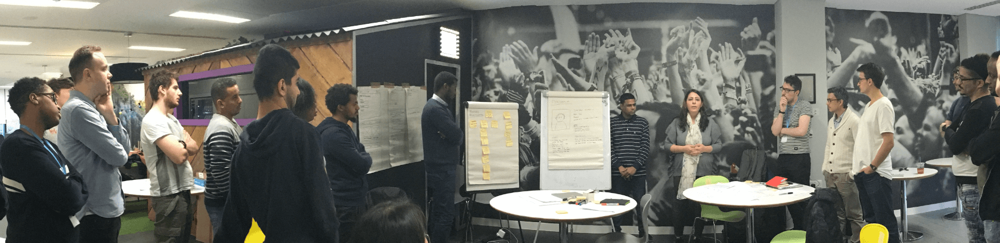

# CYF Hotel Workshop

This workshop is for the [Node 3](https://codeyourfuture.github.io/syllabus-master/node-db/week-15/workshop.html) class, read [workshop brief](https://codeyourfuture.github.io/syllabus-master/node-db/week-15/brief.html) for more information.

This exercise involves implementing various aspects of a hotel booking system. It involves a variety of operations on the database to fetch, insert and update data.

* `index.js` - sets up the application for use
* `api/` - routes and application logic for the API
* `views` - handlebar templates
* `public/*` - each folder contains the front-end code that interacts with the API
* `assets/*` - assets including fake data, CSS, JS, images

## Installation

Install the dependencies using `npm install`.

In order to launch the project run `npm start` and access the website at [http://localhost:8080/](http://localhost:8080/)

## Data

Our data contains three tables from the schema above

* `customers`
* `invoices`
* `reservations`

As mentioned in the brief, there is some data available but for privacy and security reasons you are not able to access the real data. Instead you can generate some fake data to develop your project.

In order to generate the data first run `npm install` and then `npm generate-data`. The fake data will be stored in `./assets/data`.

The data available are `customers.json`, `invoices.json` and `reservations.json`.

## User Stories

We are looking at three personas today:

* Hotel Customer
* Hotel Receptionist
* Hotel Manager

The below user stories are exercises which your team can choose to implement

`As a < type of user >, I want < some goal > so that < some reason >.`

* As a _Hotel Manager_, I want to **view a list of all customers**

* As a _Hotel Manager_, I want to **view a customers details by their customer account ID**

* As a _Hotel Manager_, I want to **view a list of all invoice**

* As a _Hotel Manager_, I want to **view a an invoice by it's Invoice ID**

* As a _Hotel Receptionist_, I want to **list of all reservations**

* As a _Hotel Receptionist_, I want to **view a reservation by it's reservation ID**

* As a _Hotel Customer_, I want to **view my invoice page** so I know how much to pay.

## Teams

Each team needs to set up a trello board and create tickets for the tickets for the work you will do.

* > Use [this example Trello board](https://trello.com/b/SK7a7cmr/team-heroes) to guide you

Your board should have: `Backlog`, `Todo`, `In Progress` and `Done` lanes, and tickets should be created in backlog from left and move along as they progress to done when they are finished.

Once you agree on your roles as backend/frontend/PM/User Experience, choose a user story from above and assign tickets to work on it collaboratively.

Since you are working in teams you have to agree one fork to contribute to, then you need to give permission to the rest of your team members to be able to contribute to it.

> Read: [Github - Inviting collaborators to a personal repository](https://help.github.com/articles/inviting-collaborators-to-a-personal-repository/)

## Deliverables

Make sure you have:

* Something to present by end of the day, even if its a small feature
* Setup your trello and have some tickets/ideas for next week
* Consider how to collaborate together, whether by slack or meeting up
